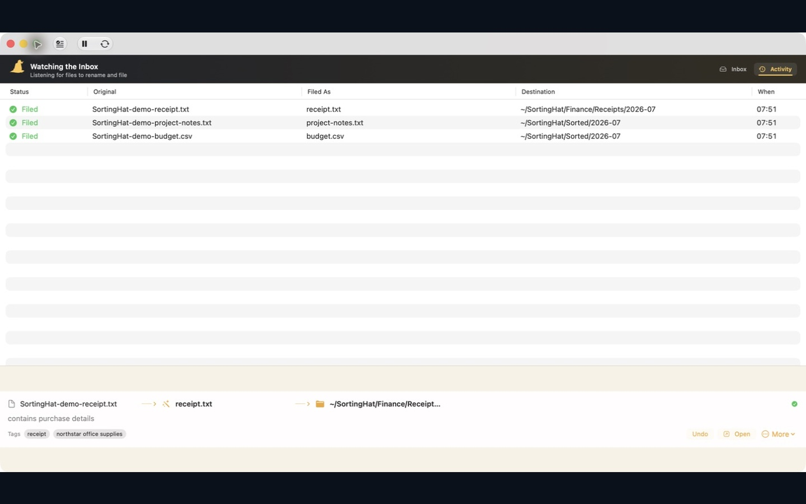

# Sorting Hat

**A drop folder with opinions.**

Sorting Hat is a local-first macOS filing assistant for anyone who wants a clean Inbox without writing automation. Describe how receipts, screenshots, documents, and downloads should be named and filed; Sorting Hat turns that plan into editable rules, extracts useful context, and validates every rename, Finder tag, and destination in Swift before touching the filesystem. The Mac App Store build uses only Apple’s on-device Foundation Model or Ollama running on the same Mac.



Build and run from source:

```sh
./script/build_and_run.sh
```

[See exactly how Sorting Hat extends Apple’s WWDC26 file-sorting demo, including the passing shipping-path benchmark and its limits.](docs/wwdc26-comparison.md)

## Requirements

- macOS 14 or later
- macOS 26, Apple Intelligence, and a supported Mac for Apple’s on-device Foundation Model
- [Ollama](https://ollama.com/) with a local model when Apple’s model is unavailable
- Swift 6.2+ to build from source
- XcodeGen 2.44.1 only when regenerating the checked-in Xcode project

## How it works

One Inbox. One output root. The model proposes; Swift decides.

1. Add a file in the app or send it through Finder’s **Send to Sorting Hat** Quick Action.
2. Sorting Hat extracts useful text, asks the selected model for a filename, tags, and destination, then validates the answer.
3. Safe decisions move to a rule-specific folder beneath your output root. Missing folders are created automatically.
4. Uncertain or invalid decisions stay in the Inbox for review. No guessing, no mystery pile called `Sorted` inside the Inbox.

The Inbox is intake-only. Sorting Hat preserves file extensions, rejects absolute paths and traversal, protects existing files with numbered names, and refuses a “rename” that leaves the original filename unchanged. Controlled `Put ... in ...` rules compile into an allow-list, so free-form model output cannot invent a destination outside the ruleset.

## The Mac app

The dashboard is the single place to see the Inbox, Activity, rules, and anything that needs attention. Left-click the menu-bar hat to open or close the dashboard. Right-click it for quick actions such as pause, resume, and sort now.

Sorting Hat watches while it is running, shows exactly how each file was renamed and filed, supports undo and manual recovery, and uses macOS’s native launch-at-login service.

### Send to Sorting Hat from Finder

Signed builds include a first-party **Send to Sorting Hat** Quick Action. Select files in Finder, then choose **Quick Actions → Send to Sorting Hat**. The action copies each file into Sorting Hat’s App Group queue. It never changes the original.

Paused apps still import files into the Inbox. Closed apps pick up staged files on the next launch. One invocation accepts up to 256 files, with a 256 MB per-file limit, a 1 GB selection limit, and a 25-second deadline. Partial failures name the files that were not queued instead of pretending the whole batch worked.

Enable the action in **System Settings → General → Login Items & Extensions → Finder**. If Finder caches the old extension state, relaunch Finder once. **Sorting Hat Settings → Finder** shows integration health, permission repair, queued copies, failures, and **Retry** or **Remove** actions. Older Automator actions with the same name can also be migrated safely. The full contract is in the [Finder Quick Action architecture notes](docs/finder-quick-action.md).

## Rules and configuration

Rules are plain language, editable, and ordered from specific routes to the catch-all:

```yaml
inbox: ~/SortingHat/Inbox
output: ~/SortingHat
settle_seconds: 2
ollama_url: http://127.0.0.1:11434
ollama_model: gemma3:4b
openai_model:
model_provider: automatic
apple_model: automatic
apple_use_case: general
apple_guardrails: default
allow_apple_pcc: false

rules:
  - Give every file a short, descriptive, lowercase filename. Use hyphens, never spaces.
  - Put receipts in Receipts/YYYY and tag them receipt and the merchant name.
  - Put screenshots in Screenshots/YYYY-MM and tag them screenshot.
  - Put everything else in Files/YYYY-MM and add one useful topic tag.
```

Keep `sortinghat.conf` in the directory where you launch the CLI, or pass `--config /path/to/sortinghat.conf`.

## Models and privacy

Source and Developer ID builds offer **Automatic**, **Apple**, **Ollama**, and **OpenAI**. Automatic mode prefers Apple’s in-process Foundation Models framework and can fall back to a provider you configured. OpenAI keys live in macOS Keychain in the app; the CLI reads `OPENAI_API_KEY`.

The Mac App Store build is stricter. It offers Apple’s on-device model and Ollama only on `localhost`, `127.0.0.1`, or `::1`. It contains no OpenAI route, no LAN or remote Ollama route, and no Private Cloud Compute option. Content-extraction failures, unsafe paths, and invalid decisions never trigger a silent cloud escalation.

For Apple’s model, `apple_use_case: content-tagging` enables the framework’s content-tagging specialisation. `apple_guardrails: permissive-content-transformations` relaxes content-transformation guardrails for filing material the default policy refuses; keep the default unless your rules need the exception. Apple requests use in-process guided generation and greedy sampling.

Private Cloud Compute remains a research target for the macOS 27 toolchain. It is not a shipping feature.

## Documents and OCR

Sorting Hat reads searchable PDFs, plain text, RTF, Word, and OpenDocument files. Apple’s Vision framework extracts text locally from scanned PDFs, receipts, and screenshots before inference. Searchable PDF text wins over OCR, which keeps the common path faster and simpler.

Extraction is capped at the first five pages and 12,000 characters. The source file is never modified during analysis. If a scan cannot be rendered or does not contain confident text, it stays in the Inbox with a visible extraction failure.

Each file gets an isolated model request. One failure does not block the rest of the Inbox. Sorting Hat favours reliable per-file naming and review over an unverified batching speed claim.

## CLI

```text
sorting-hat init [--config PATH]
sorting-hat once [--config PATH] [--dry-run]
sorting-hat watch [--config PATH] [--dry-run]
sorting-hat evaluate --live --corpus PATH --output PATH [--baseline PATH] [--config PATH]
```

Build and try the CLI:

```sh
swift build -c release
.build/release/sorting-hat init
mkdir -p ~/SortingHat/Inbox
.build/release/sorting-hat once --dry-run
.build/release/sorting-hat watch
```

`watch` uses a small polling loop. That is intentionally boring and reliable for a human-scale drop folder; an event-driven watcher can come later.

## Quality, measured

The live evaluator runs the same extractor, routing policy, and validator as the shipping app without moving source files. Use a private, anonymised corpus outside the repository and copy the schema from `Tests/SortingHatTests/Fixtures/live-evaluation-corpus.example.json`:

```sh
.build/debug/sorting-hat evaluate --live \
  --corpus ~/SortingHat-Evaluation/corpus/corpus.json \
  --output ~/SortingHat-Evaluation/results/run-001 \
  --config sortinghat.conf
```

Each run writes `evaluation.json` and `summary.md`, including the raw model proposal, final validated decision, environment, latency, accuracy, failures, invalid decisions, and abstentions. Pass a compatible previous artifact with `--baseline` to expose regressions. Exit status `2` means a quality threshold or baseline check failed; `1` means the evaluation could not run.

The completed Issue #23 gate scored 108/108 exact final decisions across nine runs, held all 18 ambiguous cases for review, and produced zero invalid final decisions. It also recorded an 8.1% pre-validation latency increase against the corrected baseline. That is the honest result: routing passed; speed did not improve. Read the method and boundaries in [`evaluation/ROUTING_RESULTS.md`](evaluation/ROUTING_RESULTS.md).

The 12-case private corpus is a regression gate, not a universal accuracy claim. Do not commit corpus documents or results containing private or copyrighted content. The standalone [`evaluation/`](evaluation/README.md) project remains available for prompt, system/content-tagging, PCC research, and bounded tool-calling experiments; none of those research tools can mutate the shipping filesystem path.

## Development

```sh
swift test
./script/generate_xcode_project.sh
./script/preflight_app_store.sh
# After one-time notarytool Keychain setup:
./script/release_local.sh 0.2.0
```

Inference sits behind `FileAnalyzing`, so filesystem safety can be tested without a live model. The Foundation Models decision path can also be shared by a future iPhone or iPad client, but iOS cannot behave like a continuously watched Mac folder. The [iOS client boundary](docs/ios-client-architecture.md) documents what is reusable and what needs a Files or Share-extension workflow.

## Distribution status

There are two release tracks. They are deliberately separate.

- **Mac App Store:** local-only build `0.1.0 (2)` passed Apple validation, processed as `VALID`, and is selected in App Store Connect. It has not been submitted for review or published. Pricing, App Privacy, export compliance, content rights, and installed-build verification still need owner sign-off.
- **GitHub and Homebrew:** the downloadable `v0.1.0` artifact is an experimental, ad-hoc-signed pre-release. It is not Developer ID signed or notarised, so Gatekeeper may block it. Issue [#24](https://github.com/tcballard/SortingHat/issues/24) tracks the signed and notarised release path.

Issue [#29](https://github.com/tcballard/SortingHat/issues/29) tracks the remaining App Store work. The [distribution guide](docs/distribution.md), [privacy policy](docs/privacy.md), and [support page](docs/support.md) hold the channel-specific details.
